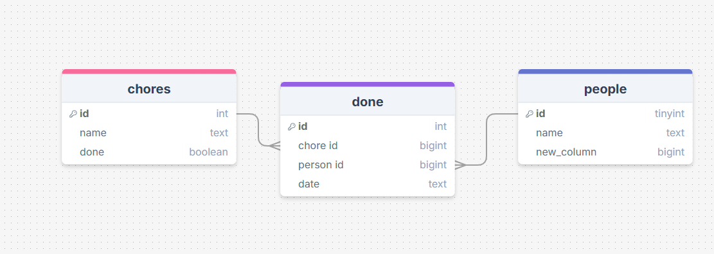

# Sprint 1 - A Working UI Prototype

## Sprint Goals

Develop a prototype that simulates the key functionality of the system, then test and refine it so that it can serve as the model for the next phase of development in Sprint 2.

[Figma](https://www.figma.com/) is used to develop the prototype.

---

## Initial Database Design
the base of my design works and i will use this for my main page

---

## UI 'Flow (chore tracker v1)'

The first stage of prototyping was to explore how the UI might 'flow' between states, based on the required functionality.

This Figma demo shows the initial design for the UI 'flow':

<iframe style="border: 1px solid rgba(0, 0, 0, 0.1);" width="800" height="450" src=
"https://embed.figma.com/proto/7YycmoYMWii3PlQ9oIZ5wx/chores-v1?scaling=min-zoom&content-scaling=fixed&page-
id=0%3A1&node-id=8-5&starting-point-node-id=8%3A5&embed-host=share" allowfullscreen></iframe>

### Testing
I took notes and some feedback from my friends and family

>Zach- They shouldn't have to have menus pop up automatically they should be able to choose what comes up. 
I want the date finished and name to be first 

### Changes / Improvements

i made it so it does'nt have to have the menu pop up automatically and they can choose what comes up

---

## Initial UI Prototype (chore tracker v2)

The next stage of prototyping was to develop the layout for each screen of the UI.

This Figma demo shows the initial layout design for the UI:

<iframe style="border: 1px solid rgba(0, 0, 0, 0.1);" width="500" height="900" src="https://embed.figma.com/proto/9Vg8FbMmnnsLYVQioRkjeL/chores-v2?scaling=min-zoom&content-scaling=fixed&page-id=0%3A1&node-id=1-2&embed-host=share" allowfullscreen></iframe>

### Testing

I took notes and some feedback from my friends and family

>Zach- having names in the home page and in each name having the chores they must do so that they don't must try and remember 

>Dad- have a back button on chores page. When you click on the chore you want to do you can select the type of location/rooms. Have sub tasks for example: for vacuum, change vacuum cleaner bag if needed. For dishwasher add unstack Dishwasher or stack 
 
### Changes / Improvements
first I added names in the first page and i made it so when you click on the names it goes to a chore i also added a back 
button on the chores screen so that if you clicked the wrong person you can go back and then with those chores I also added sub chores 

---

## Refined UI Prototype(chore tracker v3)

Having established the layout of the UI screens, the prototype was refined visually, in terms of color, fonts, etc.

This Figma demo shows the UI with refinements applied:

<iframe style="border: 1px solid rgba(0, 0, 0, 0.1);" width="800" height="450" src="https://embed.figma.com/proto/Y9GiCIWpGITHLIwOG3j7D4/chores-v3?node-id=2001-15&p=f&scaling=min-zoom&content-scaling=fixed&page-id=0%3A1&starting-point-node-id=2001%3A15&embed-host=share" allowfullscreen></iframe>

### Testing

i have finished the improvements that i got from all the feedback i did

### Changes / Improvements

I am going to change the color to make the website look good and not bad when it comes to the assessment

---

## Sprint Review

Replace this text with a statement about how the sprint has moved the project forward - key success point, any things that didn't go so well, etc.

